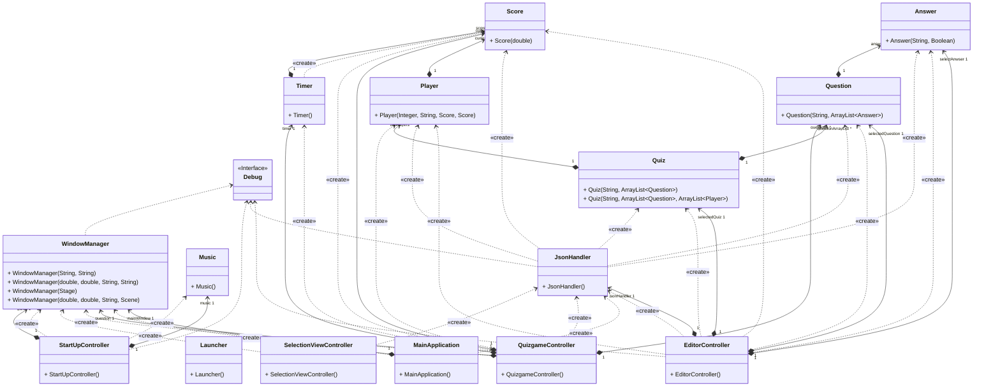
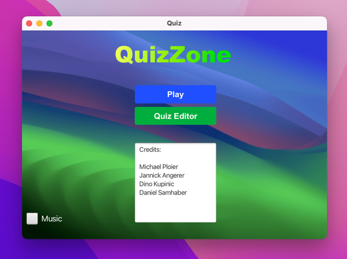
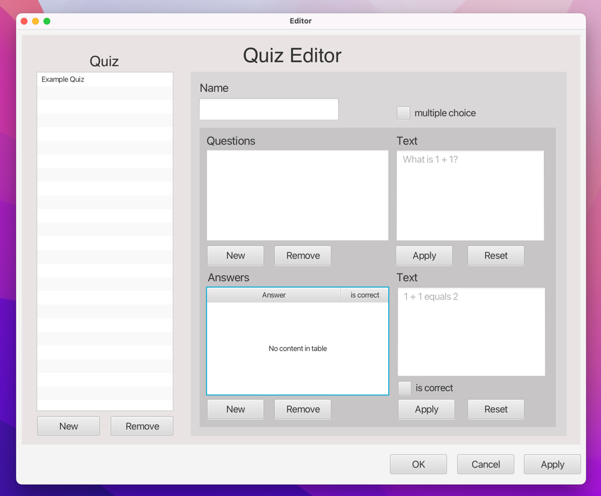
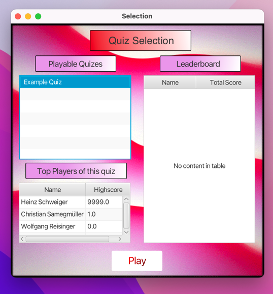
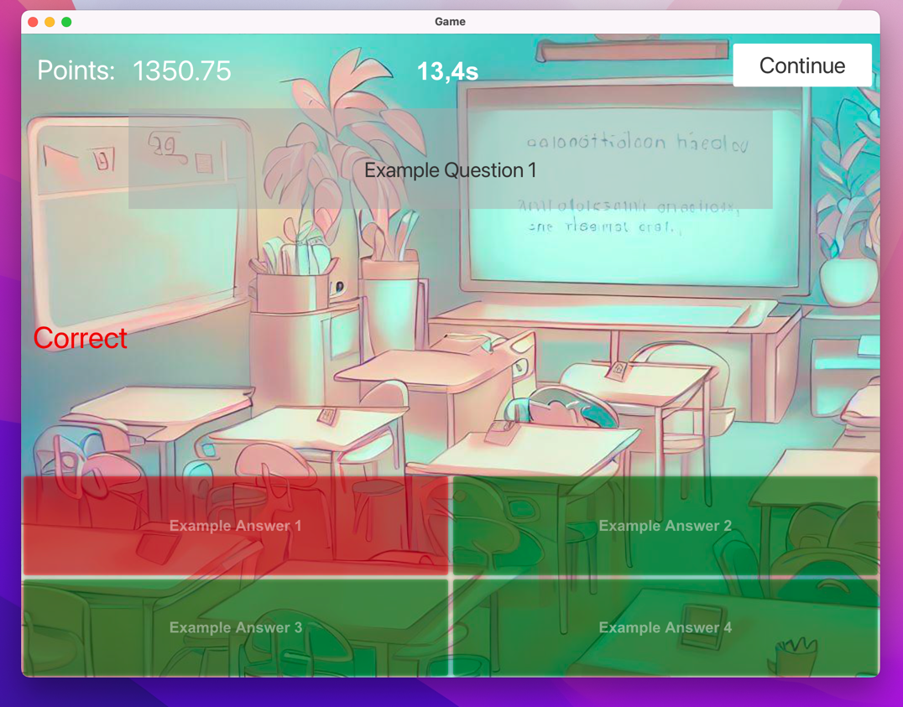
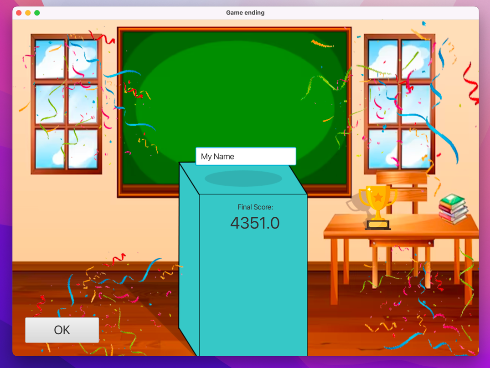

# QuizApp "QuizZone" JavaFX

### Made by Michael Ploier, Dino Kupinic, Jannick Angerer, Daniel Samhaber

---

### Features:
- Music
- Stunning art
- Highscore
- Quiz Editor
- Leaderboard

How to run:
---
Navigate to \out\artifacts\QuizApp_jar and double-click it.
You can also open it in an IDE.

### Class Diagram

---

### Preview images

