# QuizApp "QuizZone" JavaFX

### Made by Michael Ploier, Dino Kupinic, Jannick Angerer, Daniel Samhaber

---

### Features:
- Music
- Stunning art
- Highscore
- Quiz Editor
- Leaderboard

How to run:
---
Navigate to \out\artifacts\QuizApp_jar and double-click Minesweeper.jar.
You can also open it in an IDE.

### Class Diagram

---

```mermaid
classDiagram
    direction BT
    class Answer {
        + Answer(String, Boolean)
        - String answerText
        - Boolean isCorrect
        + setAnswerText(String) void
        + setCorrect(Boolean) void
        + getAnswerText() String
        + getIsCorrect() Boolean
    }
    class Debug {
        <<Interface>>
        + boolean PRINT_CLONENOTSUP
        + boolean PRINT_FILENOTFOUNDEXCEP
        + boolean PRINT_INDEXOUTOFBOUNDSEXCEP
        + boolean PRINT_NUllPOINTEXCEP
        + boolean PRINT_IOEXCEPTION
    }
    class EditorController {
+ EditorController()
- Button questionResetButton
- TableColumn~Answer, String~ answerCol
- TableView~Answer~ answerTable
- TextArea questionTextArea
- Button editorOkButton
- Button newQuestionButton
- ListView~String~ quizList
- ListView~Question~ questionList
- Button removeQuestionButton
- TableColumn~Answer, Boolean~ isCorrectCol
- TextField quizNameTextField
- Button removeAnswerButton
- Button newAnswerButton
- Label erorrLbl
- JsonHandler jsonHandler
- Button newQuizButton
- Button editorCancelButton
- Button editorApplyButton
- Quiz selectedQuiz
- Answer selectAnwser
- Button answerApplyButton
- Button questiomApplyButton
- TextArea answerTextArea
- CheckBox multipleChoiceToggle
- Button removeQuizButton
- Button answerResetButton
- CheckBox isCorrectToggle
- Question selectedQuestion
+ addQuizToList() void
- onClickEditorApply() void
- onClickQuestionList() void
- onClickToggleCorrectAnswer() void
- getNumber(ListView~T~) int
- getNumber(TableView~T~) int
- onClickAnswerBtn(Event) void
+ initFXML() void
- onClickQuizButton(Event) void
- onClickQuizList() void
- onClickQuestionBtn(Event) void
- onClickAnswerList() void
}
class JsonHandler {
+ JsonHandler()
- Gson gson
- Path PATH_PLAYER_JSON
- File playerJsonFile
- File questionJsonFile
- String dataJsonBackUpString
- Path PATH_DATA_JSON
+ getDataJsonBackUpString() String
+ isDataJsonValid() boolean
+ setDataJsonBackUpString(String) void
+ deleteQuizFromJson(T) void
+ checkIfQuestionAlreadyExists(Quiz, Question) boolean
+ readAllPlayers() ArrayList~Player~
+ replaceQuizInJson(Quiz) void
+ checkIfQuizAlreadyExists(Quiz) boolean
+ getAllAnswerForTableView(ArrayList~Answer~) ObservableList~Answer~
+ backupDataJson() void
- assembleQuizJsonObject(Quiz, JsonArray) void
- isMatchingQuiz(JsonObject, T) boolean
+ getAllPlayersForTableView(ArrayList~Player~) ObservableList~Player~
- getStringBuilder(File) StringBuilder
+ getAllQuizes() ArrayList~Quiz~
+ replaceQuizInJson(Quiz, Quiz) void
+ checkIfAnswerAlreadyExists(Quiz, Question, Answer) boolean
+ writePlayerToJson(Player) void
- readTopPlayers(JsonObject) ArrayList~Player~
+ isPlayerJsonValid() boolean
+ writeQuizToJson(Quiz) void
+ createExampleQuiz() void
- addJSONArray(File) void
- readQuestions(JsonArray) ArrayList~Question~
+ getQuizByName(String) Quiz
+ getAnswerByText(Question, String) Answer
+ getQuestionByText(Quiz, String) Question
+ getAllTopPlayersForTableView(Quiz) ObservableList~Player~
+ addJsonArrayIfJsonIsntValid() void
}
class Launcher {
+ Launcher()
}
class MainApplication {
+ MainApplication()
+ int WIDTH
+ WindowManager mainWindow
+ int HEIGHT
+ start(Stage) void
+ main(String[]) void
+ checkDataJson() void
}
class Music {
+ Music()
- Media media
- File musicFile
- Boolean musicStatus
- MediaPlayer mediaPlayer
+ PlayMusic() void
+ getMusicStatus() Boolean
+ StopMusic() void
+ setMusicStatus(Boolean) void
}
class Player {
+ Player(Integer, String, Score, Score)
- Integer id
- String name
- Score currentScore
- Score totalScore
+ getName() String
+ getTotalScore() Score
+ getId() Integer
+ getCurrentScore() Score
+ setTotalScore(Score) void
+ setId(Integer) void
+ setName(String) void
+ setCurrentScore(Score) void
}
class Question {
+ Question(String, ArrayList~Answer~)
- String question
- ArrayList~Answer~ answerArrayList
+ setQuestion(String) void
+ changeAnswer(int, String) void
+ checkValidCorrectAnswer(Answer) boolean
+ getQuestion() String
+ getAnswerArrayList() ArrayList~Answer~
+ removeAnswer(int) void
+ setAnswerArrayList(ArrayList~Answer~) void
+ toString() String
}
class Quiz {
+ Quiz(String, ArrayList~Question~, ArrayList~Player~)
+ Quiz(String, ArrayList~Question~)
- ArrayList~Question~ questionArrayList
- String name
- ArrayList~Player~ topPlayers
+ setName(String) void
+ setTopPlayers(ArrayList~Player~) void
+ toString() String
+ setQuestionArrayList(ArrayList~Question~) void
+ getName() String
+ getQuestionArrayList() ArrayList~Question~
+ getTopPlayers() ArrayList~Player~
+ clone() Object
}
class QuizgameController {
+ QuizgameController()
- TextField yourNameField
- Button OkButton
- Label questionLbl
- Button ctnueBtn
- ColumnConstraints trueFalsePane
- Path imagePath
- AnchorPane fourAnswerAnchorPane
- Score currentScore
- AnchorPane trueFalseAnchorPane
- Button trueBtn
- Label pointsLabel
- Button toprightBtn
- Button falseBtn
- int i
- int questionCount
- Timer timer
- Label correctLabel
- WindowManager question
- Button topleftBtn
- Label podiumScoreLabel
- ArrayList~Question~ questions
- Label questionLblBackground
- Label timerLabel
- Button bottomleftBtn
- Button bottomrightBtn
- ColumnConstraints buttonPane
+ onYourNameInput() void
+ onAnswerButtonClicked(ActionEvent) void
- displayCorrect4Answers(Question) void
+ onOkButtonClicked() void
+ ctnueBtnClicked() void
+ checkCorrect(String) boolean
+ setTimerLabel(String) void
- setButtonsAndBackground(DropShadow, Button, Button, AnchorPane) void
- displayCorrect2Answers(Question) void
+ setTrueFalseGame() void
+ setFourAnswerGame() void
+ initialize() void
}
class Score {
+ Score(double)
- double score
+ getScore() double
+ setScore(double) void
+ updateScore() void
}
class SelectionViewController {
+ SelectionViewController()
- TableColumn~Player, String~ nameCol
- TableColumn~Player, Score~ scoreCol
- TableView~Player~ topPlayers
- ListView~String~ quizesList
- TableView~Player~ leaderboard
- SelectionViewController instance
- TableColumn~Player, String~ nameColBestPlayers
- TableColumn~Player, Score~ scoreColBestPlayers
+ String selectedItem
+ getInstance() SelectionViewController
+ displayLeaderboard() void
+ displayTopPlayers() void
+ addQuizToList() void
+ qsPlayBtnClicked() void
- getPropertyOfScoreClass(TableColumn~Player, Score~) void
+ initialize() void
}
class StartUpController {
+ StartUpController()
- Music music
- CheckBox musicToggle
- StartUpController instance
+ WindowManager game
+ onMusicButtonPressed() void
- onCreateButtonClicked() void
+ onPlayButtonClicked() void
+ getInstance() StartUpController
}
class Timer {
+ Timer()
- float timePlayed
- long lastFrame
- Score score
- AnimationTimer animationTimer
- boolean activeTimer
+ stopTimer() void
+ getScore() double
+ setActiveTimer(boolean) void
+ setScore(Score) void
+ getActiveTimer() boolean
+ setTimePlayed(int) void
+ startTimer(QuizgameController) void
}
class WindowManager {
+ WindowManager(double, double, String, String)
+ WindowManager(String, String)
+ WindowManager(double, double, String, Scene)
+ WindowManager(Stage)
- Scene globalScene
- String fxmlFileName
- double width
- String title
- FXMLLoader fxmlLoader
- double height
- Stage globalStage
+ getFxmlFileName() String
+ newStage() Stage
+ close() void
+ getWidth() double
+ getHeight() double
+ updateGlobalStage() void
+ getGlobalStage() Stage
+ getGlobalScene() Scene
+ newStage(int, int, String, String) Stage
+ getTitle() String
+ setFxmlFileName(String, boolean) void
+ setGlobalScene(Scene) void
+ setTitle(String) void
+ setGlobalStage(Stage) void
+ setWidth(double) void
+ close(Stage) void
+ setHeight(double) void
+ getController() Object
}

EditorController  ..>  Answer : «create»
EditorController "1" *--> "selectAnwser 1" Answer
EditorController  ..>  Debug
EditorController  ..>  JsonHandler : «create»
EditorController "1" *--> "jsonHandler 1" JsonHandler
EditorController  ..>  Player : «create»
EditorController  ..>  Question : «create»
EditorController "1" *--> "selectedQuestion 1" Question
EditorController "1" *--> "selectedQuiz 1" Quiz
EditorController  ..>  Quiz : «create»
EditorController  ..>  Score : «create»
JsonHandler  ..>  Answer : «create»
JsonHandler  ..>  Debug
JsonHandler  ..>  Player : «create»
JsonHandler  ..>  Question : «create»
JsonHandler  ..>  Quiz : «create»
JsonHandler  ..>  Score : «create»
MainApplication  ..>  JsonHandler : «create»
MainApplication  ..>  WindowManager : «create»
MainApplication "1" *--> "mainWindow 1" WindowManager
Player "1" *--> "currentScore 1" Score
Question "1" *--> "answerArrayList *" Answer
Quiz "1" *--> "topPlayers *" Player
Quiz "1" *--> "questionArrayList *" Question
QuizgameController  ..>  JsonHandler : «create»
QuizgameController  ..>  Player : «create»
QuizgameController "1" *--> "questions *" Question
QuizgameController "1" *--> "currentScore 1" Score
QuizgameController  ..>  Score : «create»
QuizgameController "1" *--> "timer 1" Timer
QuizgameController  ..>  Timer : «create»
QuizgameController  ..>  WindowManager : «create»
QuizgameController "1" *--> "question 1" WindowManager
SelectionViewController  ..>  JsonHandler : «create»
SelectionViewController  ..>  WindowManager : «create»
StartUpController  ..>  Debug
StartUpController  ..>  Music : «create»
StartUpController "1" *--> "music 1" Music
StartUpController "1" *--> "game 1" WindowManager
StartUpController  ..>  WindowManager : «create»
Timer "1" *--> "score 1" Score
Timer  ..>  Score : «create»
WindowManager  ..>  Debug

```

### Preview images

